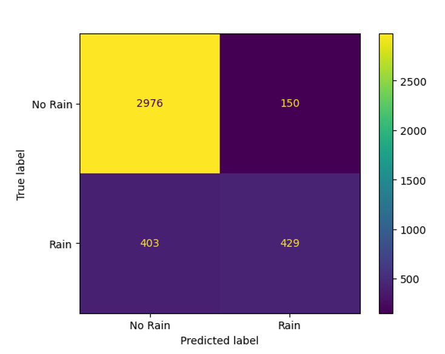
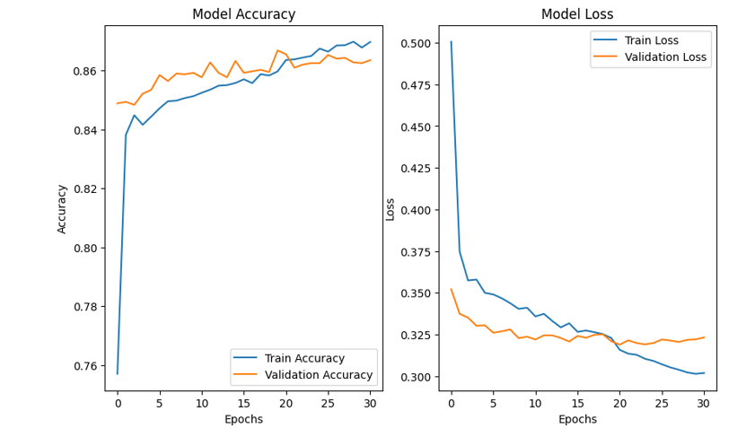
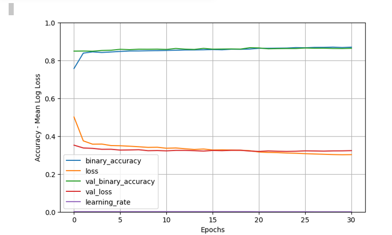

# Report Finale del Modello

## Matrice di Confusione

La matrice di confusione mostra che il modello ha un comportamento molto solido sulla classe maggioritaria **"No Rain"**, con **2976 previsioni corrette** su **3126 casi reali**.

Per la classe **"Rain"**, il modello riesce a identificare correttamente **429 casi**, ma presenta **403 falsi negativi** (cioè pioveva ma è stato previsto "no rain"). Questo suggerisce che il modello può ancora migliorare nella rilevazione degli eventi meno frequenti.

 *Possibile miglioramento futuro*: applicare tecniche di bilanciamento del dataset (come SMOTE o oversampling) per migliorare le performance sulla classe minoritaria.

---

## Andamento della Accuracy e della Loss

Nel grafico sottostante si osserva:

- Un incremento costante della **accuracy** su training e validation.
- Una **diminuzione progressiva della loss**.
- Le curve convergono senza divergere → indica **assenza di overfitting**.

---

## Prestazioni Finali

- **Accuracy generale**: **0.86**
- **F1-Score (No Rain)**: **0.91**
- **F1-Score (Rain)**: **0.61**
- **Macro F1**: **0.76**
- **Weighted F1**: **0.86**

Nonostante il leggero sbilanciamento delle classi, il modello mantiene prestazioni **generali elevate e bilanciate**.
